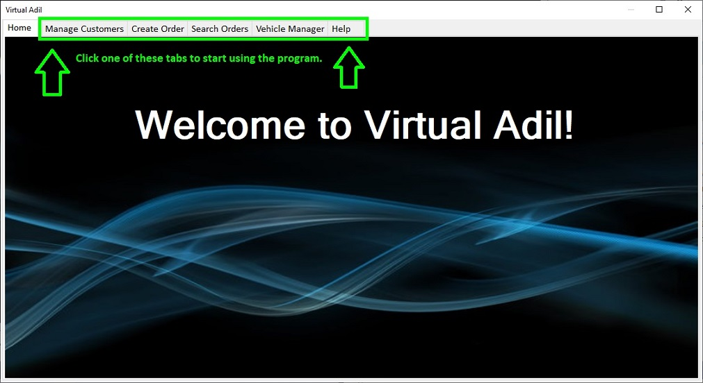
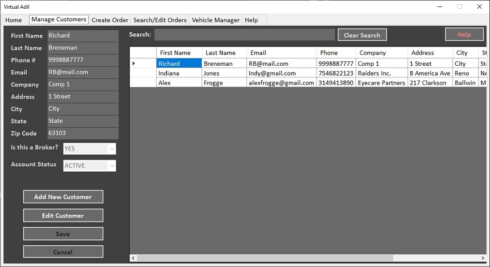
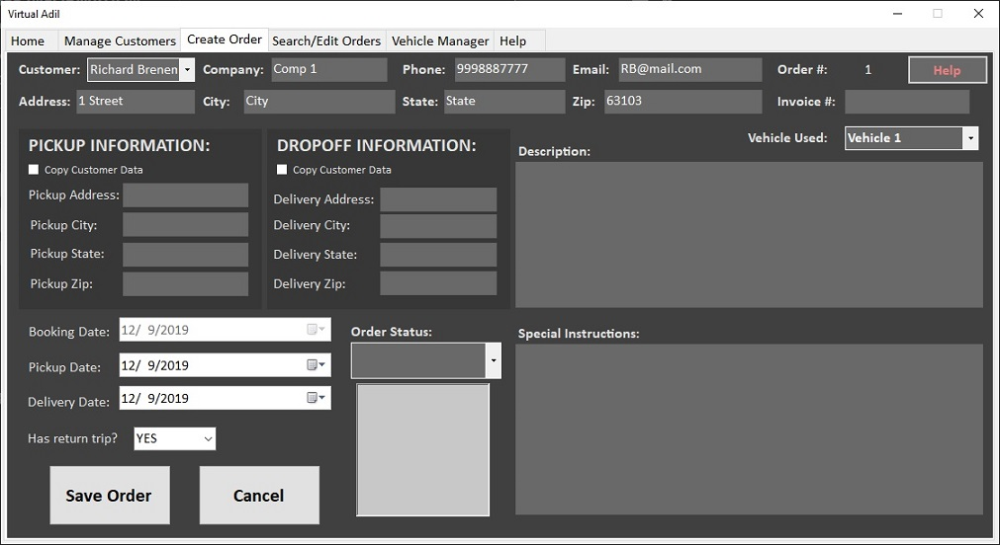
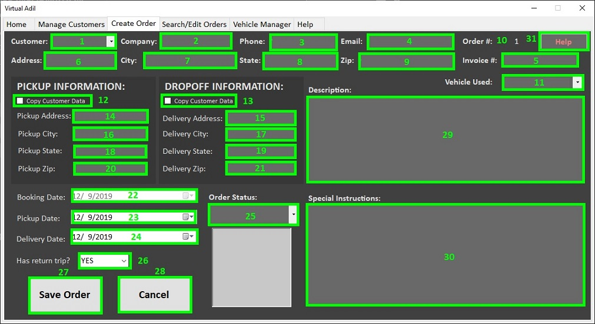

# Virtual Adil: Help

## Table of Contents:
* <a href="#welcome">**Welcome to Virtual Adil**</a>
* <a href="#homepage">**Home Page**</a>
* <a href="#managecustomers">**Manage Customers**</a>
    * <a href="#managecustomersvisual">Manage Customers - Visual Reference</a>
* <a href="#createorders">**Create Orders**</a>
    * <a href="#createordersvisual">Create Orders - Visual Reference</a>
* <a href="#searchorders">**Search Orders**</a>
    * <a href="#searchordersvisual">Search Orders - Visual Reference</a>
* <a href="#vehiclemanager">**Vehicle Manager**</a>
    * <a href="#vehiclemanagervisual">Vehicle Manager - Visual Reference</a>

## Welcome to Virtual Adil!
**Virtual Adil** is a software program created by DaphAdil Consulting for keeping track of a shipping company's clients and work orders. This help page will provide you with instructions on how to use the various components of the software and diagrams showing the function of certain components.

<a href="#top">Return to Table of Contents</a>

## Home Page

This is the first page the user will see when they launch the application, sometimes known as a *splash screen*. This page simply acts as a welcoming graphic for the user, and a notification that it is ready to use. To start using Virtual Adil, click on one of the other tabs at the top of the application window. 

<a href="#top">Return to Table of Contents</a>

## Manage Customers

The **Manage Customers** tab is where new customers are added to the Customer table. The user can also use this window to make changes to existing customer records. The left side of the window allows the user to interact with each field of data, while the right side displays a list of existing records in the Virtual Adil database, along with controls that allow the user to sort and search the fields.

>**Note: Database Terms**  A full customer entry (including name, address, phone number, etc.) is referred to as a **record** in this document.  A single bit of information (like Zip Code) is called a **field**. A full customer **record** is made up of ten **fields**.  All of the **records** combined make up the full Customer **table**, which, like the Orders **table**, is part of the Virtual Adil **database**.

### To Add a New Customer:

1. Click the **Add New Customer** button to unlock the customer information fields for data entry.
2. Fill in all of the fields.
3. Hit the Save button to lock in your changes. Your new customer will immediately be entered into the database. 

If the customer information is not immediately visible in the Table View, you can use the Search feature at the top of the window to find it and confirm that it has been entered *(read more about Search <a href="#searchingcustomers">below</a>).*

### To Edit an Existing Customer: 

1. Select the record (row) you wish to edit in the Table View on the right side of the window.
2. Click the Edit Customer button to unlock the customer information fields for editing.
3. Change any field you wish.
4. Hit the Save button to lock in your changes. The customer record will be updated to reflect your changes.

### To Search for an Existing Customer:

1. Simply type in the **Search** box. You will search in all fields for the information typed. Matches will be displayed in the Table View in the lower right.

>**Note**: See the Visual Reference below for a description of each element in this tab.

<a href="#top">Return to Table of Contents</a>

## Manage Customers - Visual Reference

| Number | Field Name | Purpose |
| ----| ---------- | ------- |
| **1** | **First Name** | Customer's first name |
| **2** | **Last Name** | Customer's last name |
| **3** | **Phone #** | **Must be 10 digits.** Stores a phone number for contact info.  |
| **4** | **Email** | **Must have proper form.**  Stores the customer email. Email cannot be entered without an "@" sign and "." in the proper place.|
| **5** | **Company** | Company the customer represents |
| **6** | **Address** | Street Address of the customer, used for billing |
| **7** | **City** | City where the customer is located |
| **8** | **State** | State where the customer is located |
| **9** | **Zip Code** | Customer's ZIP Code |
| **10** | **Broker Yes/No?** | Designates this contact as a broker. Doing this will allow you to distinguish and sort brokers separately if needed. |
| **11** | **Add New Customer button** | This button is used to start the process of adding a new customer. Until this button is pressed, the customer information fields will remain inactive. |
| **12** | **Edit Customer button** | **Select a record before pressing this button.** This button will give the user access to edit the currently selected record in the Table View.  |
| **13** | **Save Button** | The Save button will save the current changes in the customer information fields. This button becomes active when Adding a new customer or when Editing an existing customer.  |
| **14** | **Cancel Button** | The Cancel button cancels the Add or Edit operation, clearing out the customer information fields and leaving the database table unchanged. |
| **15** | **Search Box** | Use the Search box to find customers. You can search by a word in any field. **You can also sort the Customers by field by clicking on the column headers.**|

<!-- | **16** | **Table View** | List of existing records. You can sort it by any particular field by clicking on column headers. Records displayed here will change based on Search results. |
| **17** | **Help Button** | Takes you to the relevant section of this Help Page, depending on where the Help Button was clicked. | -->

<a href="#top">Return to Table of Contents</a>

## Create Orders

The **Create Orders** tab is where new orders are added to the Orders table.  Across the top is customer information, which can be pulled in by selecting a customer in the dropdown menu in the far upper left.  Pickup and Dropoff Information specify the address information for the work order's origin and destination, and can be quickly filled out by using the Copy Customer Data control.  Booking Date keeps track of the date the order was received, and Pickup/Delivery Date reflect the date of pickup and dropoff. All three dates must be in the proper order (dropoff date cannot be before pickup date, for example).  Description and Special Instructions in the lower right are for any notes the user would like to add to the order.  Finally, the Order Status allows the user to flag a job as Pending, In Transit, Delayed, Complete, or Cancelled. The user can then use the Search Orders tab to search for orders by this status (for example, list all jobs that are Complete).

>**Note: Database Terms**  A full work order entry (including pickup, dropoff, status, etc.) is referred to as a **record** in this document.  A single bit of information (like Booking Date) is called a **field**. A full work order **record** is made up of fifteen **fields**.  All of the **records** combined make up the full Orders **table**, which, like the Customers **table**, is part of the Virtual Adil **database**.

### To Create a New Order 
Once the customer information has been pulled in, it fills the top two rows of fields. This information can be edited here for use in the next step. 

1. Use the customer dropdown menu in the upper left to select a customer. **Customers must be created in the Manage Customers tab before their information can be pulled into a Work Order.**
2. Make any necessary edits to the fields if there are changes specific to this work order. (Permanent edits to customer records can be performed in the **Manage Customer** tab.)
3. Fill out the Pickup Information section with the address of the pickup location. Clicking "Copy Customer Data" will pull the information in the fields at the top into these fields.
4. Repeat Step 3 for the Dropoff Information section. You can change the customer listed at the top between Steps 3 and 4 to pull in different information.
5. Specify the Booking, Pickup, and Delivery dates. Dates are checked to make sure they are in chronological order.
6. Fill out Description and Special Instructions if desired; then choose an Order Status.
7. Hit Save Order to save the order into the database.

At any time, you can hit Cancel to discard your changes and leave the database unchanged.

<a href="#top">Return to Table of Contents</a>

## Create Orders - Visual Reference

| Number | Field Name | Purpose |
| ----| ---------- | ------- |
| **1** | **Customer** | Customer's name. Also pulls in corresponding data from the Customer table. |
| **2** | **Company** | Customer's company name. |
| **3** | **Phone** | **Must be 10 digits.** Stores a phone number for contact info.  |
| **4** | **Email** | **Must have proper form.**  Stores the customer email. Email cannot be entered without an "@" sign and "." in the proper place.|
| **5** | **Invoice #** | Invoice # is a user-editable field for entering order or invoice numbers for instant reference. |
| **6** | **Address** | Street Address of the customer, used for billing |
| **7** | **City** | City where the customer is located |
| **8** | **State** | State where the customer is located |
| **9** | **Zip** | Customer's ZIP code |
| **10** | **Order #** | For database use only; do not edit |
| **11** | **Vehicle Used** | Specifies the vehicle used to complete the order. |
| **12-13** | **Copy Customer Data** | **Select a record before pressing this button.** When clicked, this copies the address information from the top fields into either Pickup or Dropoff Information.  |
| **14-15** | **Pickup/Delivery Address** | Origin and destination street addresses for the work order  |
| **16-17** | **Pickup/Delivery City** | Origin and destination cities |
| **18-19** | **Pickup/Delivery State** | Origin and destination state |
| **20-21** | **Pickup/Delivery Zip** | Origin and destination ZIP |
| **22** | **Booking Date** | The date upon which the job was accepted |
| **23** | **Pickup Date** | The date when the shipment needs to be picked up |
| **24** | **Delivery Date** | The due date for shipment dropoff |
| **25** | **Order Status** | Allows the user to mark the work order as Pending, In Transit, Delayed, Complete, or Cancelled |
| **26** | **Create Order Button** | Initiates order creation and unlocks the Customer dropdown in the upper left to create a new order |
| **27** | **Save Order Button** | Saves the new work order to the database. Incomplete fields may stop this button from saving until the fields are filled out. |
| **28** | **Cancel Button** | Cancels order creation, making no changes to the database. |
| **29** | **Description Box** | Box for user-readable info about the cargo, or anything else. |
| **30** | **Special Instructions Box** | Box for user-readable special instructions concerning scheduling and directions for the work order. |

<a href="#top">Return to Table of Contents</a>

## Search/Edit Orders 

The Search/Edit Orders tab allows the user to search all created Work Orders and edit them if needed. To search an order, type any text into the **Search Orders** box and hit Enter. The matching records will be displayed below in the Table View. 
### To Edit a Record:
1. Use **Search** to find the record you want to edit.
2. Click on it in the Table View and hit **Edit Order**.
3. Make the necessary edits.
4. Hit the Save Order button (in the same spot the Edit Order button was).

<a href="#top">Return to Table of Contents</a>

## Search/Edit Orders - Visual Reference

| Number | Field Name | Purpose |
| ----| ---------- | ------- |
| **1** | **Booking Date** |  The date that the job or work order was accepted by the user's organization. |
| **2** | **Pickup Date** |  The date that the shipment must be picked up. |
| **3** | **Delivery Date** |  The date by which the shipment must be delivered.  |
| **4** | **Order #** | ***Not Editable***. Database number that refers to the Order in the database and cannot be changed.  |
| **5** | **Customer ID** | ***Not Editable***. Database number that refers to the Customer in the database and cannot be changed.  |
| **6** | **Vehicle Used** | The vehicle used to carry out the Work Order. |
| **7** | **Invoice #** | User-editable reference number for tracking each Work Order. |
| **8** | **Order Status** | Current status of the Work Order - Pending, In Transit, Delayed, Complete, or Cancelled.  |
| **9** | **Customer** | Customer's full name associated with the Work Order. |
| **10** | **Pickup Address** | The address where the shipment will be picked up for the job.  |
| **11** | **Pickup City** | The city where the shipment will be picked up.  |
| **12** | **Pickup State** | The state in which the shipment will be picked up. |
| **13** | **Pickup Zip** | The ZIP Code of the shipment origin.  |
| **14** | **Delivery Address** | The address where the shipment will be dropped off for the job.  |
| **15** | **Delivery City** | The address where the shipment will be dropped off.  |
| **16** | **Delivery State** | The state in which the shipment will be dropped off.  |
| **17** | **Delivery Zip** | The ZIP Code of the shipment destination.  |
| **18** | **Description Box** | User-editable field for any additional info such as cargo description or number of pieces.  |
| **19** | **Special Instructions** |  User-editable field for any special delivery instructions such as "park in back" or "ask for Karen". |
| **20** | **Search Orders Box** | Type a word or phrase into this box to search the existing Work Orders for a match. **You can also sort the Work Orders by field by clicking on the column headers.** |
| **21** | **Edit Order Button** | Click this button to unlock the fields to edit the currently selected record in the Table View.  |

<!-- | **22** | **Table View** | List of existing records. You can sort it by any particular field by clicking on column headers. Records displayed here will change based on Search results. |
| **23** | **Help Button** | Takes you to the relevant section of this Help Page, depending on where the Help Button was clicked. | -->

<a href="#top">Return to Table of Contents</a>

## Vehicle Manager

The Vehicle Manager allows the user to create and store records of vehicles the company owns. They can then be associated with Work Orders as needed.

### To Add a Vehicle:
1. Click the Add Vehicle button.
2. Enter the Vehicle name. This is the name that will be displayed when selecting a vehicle in the Create Orders and Search Orders tabs.
3. Type any additional information in the Vehicle Notes field.
4. Hit the Save button when finished.

### To Edit a Vehicle:
1. Select the vehicle in the Table View on the left.
2. Hit the Edit button and make your changes.
3. Hit the Save button when finished.

<a href="#top">Return to Table of Contents</a>

## Vehicle Manager - Visual Reference

| Number | Field Name | Purpose |
| ----| ---------- | ------- |
| **1** | **Add Vehicle Button** | Customer's first name |
| **2** | **Save Button** | Customer's last name |
| **3** | **Cancel Button** | **Must be 9 digits.** Stores a phone number for contact info.  |
| **4** | **Edit Button** | **Must have proper form.**  Stores the customer email. Email cannot be entered without an "@" sign and "." in the proper place.|
| **5** | **Table View** | List of existing records. You can sort it by any particular field by clicking on column headers. Records displayed here will change based on Search results. |
| **6** | **Help Button** | Takes you to the relevant section of this Help Page, depending on where the Help Button was clicked. |

<a href="#top">Return to Table of Contents</a>
